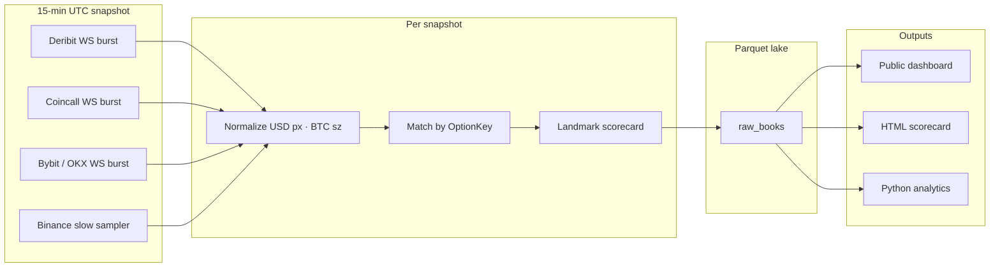

# CryoBookQ

**Compare BTC option orderbook quality across exchanges — on the same contracts, with the same metrics.**

CryoBookQ captures top-of-book depth from five venues every 15 minutes, normalizes prices and sizes to comparable USD/BTC units, and scores how tight and deep each exchange’s displayed liquidity is at standard option landmarks. Deribit is the **listing hub**: landmarks and deltas come from Deribit-listed names; other venues are scored independently on matching contracts.

**Live dashboard:** [apps.aureas.xyz/bookq](https://apps.aureas.xyz/bookq)

---

## What it measures

For each venue CryoBookQ reads **L5 order books** (public market data only — no trading) and computes:

| Metric | Meaning |
|--------|---------|
| **Spread** | `(ask₁ − bid₁) / mid` as a percentage |
| **$10k lift** | Effective premium paid above mid when lifting ~$10,000 of option premium through L5 |
| **Depth** | Sum of L5 bid + ask premium notional (USD) |

These roll into a **0–10 scorecard** per landmark cell, then into an overall index:

| Component | Weight | What it covers |
|-----------|--------|----------------|
| **Grid** | 60% | 3×3 matrix: short / mid / far tenor × 50Δ / 25Δ / 7.5Δ |
| **Wings** | 20% | Far OTM books at ~2.5Δ (kept separate so thin wings do not dominate) |
| **Presence** | 20% | Share of hub-listed contracts this venue quotes two-sided (|Δ| ≥ 0.05) |

**Catalogue** (reported separately) measures quotable surface area — hub coverage plus liquidity-gated “extras.”

Period scores use an **equal-weight mean** across snapshots (dashboard default: last **4** × 15 min). See [docs/SCORING.md](docs/SCORING.md) for reference bands and methodology.

---

## Venues

| Venue | Role | Notes |
|-------|------|-------|
| **Deribit** | Listing hub | Coin-margined BTC options; defines universe + Δ |
| **Coincall** | Peer | USD premium; requires API keys |
| **Bybit** | Peer | USDT European options |
| **OKX** | Peer | BTC-USD inverse; contract multipliers normalized |
| **Binance** | Peer | USDT eapi; slow sampler (WS + paced REST) |

Product choices and unit conversion: [docs/VENUES.md](docs/VENUES.md).

---

## How it works



1. **Capture** — At `:00 / :15 / :30 / :45` UTC each venue runs an isolated async burst (timeouts so one slow venue does not block peers).
2. **Normalize** — All adapters emit native units; a single pipeline converts to USD premium and BTC size.
3. **Match** — Contracts join on `(underlying, expiry, strike, call/put)`. No N-way intersection requirement.
4. **Score** — Nearest listed expiry to tenor targets; nearest call + put to each |Δ| target; average.
5. **Store** — Daily zstd Parquet under `data/raw_books/date=YYYY-MM-DD/part-{ts_ms}.parquet`.
6. **Surface** — Flask hub, HTML reports (`tools/scorecard_html.py`), importable analytics library.

Architecture detail: [docs/ARCHITECTURE.md](docs/ARCHITECTURE.md).

---

## Quick start

**Requirements:** Python 3.12+

```bash
python3.12 -m venv .venv
source .venv/bin/activate
pip install -e ".[dev,hub]"
cp .env.example .env   # optional: COINCALL_* for Coincall capture
pytest tests/unit -v
```

### One snapshot (all five venues)

```bash
python -m cryobookq.daemon --once \
  --venues deribit,coincall,bybit,okx,binance \
  --duration 30
```

Peers listen ~30s (`BOOKQ_WS_COLLECT_S`). Binance uses a longer sampler cap (`BOOKQ_BINANCE_TIMEOUT_S`, default 90s).

### Local hub

```bash
python -m cryobookq.hub.app
# → http://127.0.0.1:8088/
```

Set `BOOKQ_HUB_MOUNT=/bookq` when proxying under a subpath (production nginx).

### HTML scorecard report

```bash
python tools/scorecard_html.py --last 4 -o reports/scorecard.html
```

### Analytics API

```python
from pathlib import Path

from cryobookq.analytics.scorecard import aggregate_scorecards, build_scorecards_from_raw
import pandas as pd

paths = sorted(Path("data/raw_books").glob("date=*/part-*.parquet"))[-4:]
df = pd.concat(pd.read_parquet(p) for p in paths)
cards = build_scorecards_from_raw(df)
blend = aggregate_scorecards(cards) if len(cards) > 1 else cards[0]
print(blend.overall)
```

---

## Configuration

Environment variables use the `BOOKQ_*` prefix (see [.env.example](.env.example)):

| Variable | Default | Purpose |
|----------|---------|---------|
| `BOOKQ_DATA_DIR` | `./data` | Parquet lake root |
| `BOOKQ_SNAPSHOT_INTERVAL_MIN` | `15` | Capture cadence |
| `BOOKQ_HUB_SNAPSHOT_N` | `4` | Rolling mean window for dashboard |
| `BOOKQ_HUB_MOUNT` | _(empty)_ | URL prefix e.g. `/bookq` behind nginx |
| `BOOKQ_HEALTH_PORT` | `8091` | Daemon health HTTP |
| `BOOKQ_HUB_PORT` | `8088` | Flask hub |

Coincall: `COINCALL_API_KEY` / `COINCALL_API_SECRET` in `.env`.

---

## Testing

```bash
pytest tests/unit -v                    # default (no network)
pytest tests/live -m live -o addopts= -v   # public MD only; never places orders
```

---

## Deployment

Production host: **apps.aureas.xyz** (`/apps/cryobookq`). Systemd units in [deploy/](deploy/).

```bash
./deploy/deploy.sh --dry-run
# Live deploy requires explicit operator approval + BOOKQ_ALLOW_DEPLOY=1
```

Ops runbook: [docs/OPS.md](docs/OPS.md). **Do not deploy or wipe production `data/` without approval.**

---

## Documentation

| Document | Contents |
|----------|----------|
| [docs/SPEC.md](docs/SPEC.md) | Product spec and milestones |
| [docs/SCORING.md](docs/SCORING.md) | Scorecard math and 0–10 maps |
| [docs/VENUES.md](docs/VENUES.md) | Exchange adapters and units |
| [docs/ARCHITECTURE.md](docs/ARCHITECTURE.md) | Pipeline and invariants |
| [docs/OPS.md](docs/OPS.md) | Systemd, health, soak checklist |
| [AGENTS.md](AGENTS.md) | Contributor/agent conventions |

---

## Project status

Core pipeline (M0–M5) and multi-exchange venues (ME0–ME4) are implemented. The public dashboard and five-venue capture run on apps.aureas.xyz. CryoBookQ is **research tooling** — figures describe displayed liquidity at capture time, not guaranteed fill quality under stress.

---

## License

[MIT](LICENSE) — Copyright (c) 2026 Aureas GmbH.

Independent research tooling. Not an exchange publication. See dashboard footer for Impressum / Datenschutz on the public site.
