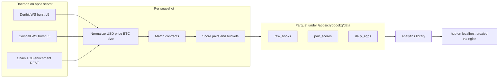

# CryoBookQ — Exchange orderbook quality comparer

> **Repo status:** M0–M5 implemented locally (2026-08-26). Dual snapshot → match → score → Parquet + hub + deploy artifacts.  
> **Next:** **M6** apps deploy — **explicit approval required**. Do not run `deploy.sh` against prod without it.

## Target state (product)

Continuously compare **Deribit vs Coincall** BTC option orderbook quality across the **full chain** (all shared expiries), not landmark strikes.

| Knob | v1 choice |
|------|-----------|
| Underlyings | BTC only; venue/collector interface ETH-ready |
| Venues | Deribit + Coincall; `Venue` Protocol for a third later |
| Cadence | **15 min** UTC (`:00/:15/:30/:45`) |
| Depth | **Top 5** levels each side |
| Capture | WS **burst** (not always-on; not full-chain REST L5) |
| Storage | Daily zstd Parquet (`raw_books`, `pair_scores`, optional `daily_aggs`) |
| Surface | Python analytics library + small Flask/htmx hub |
| Host | **apps.aureas.xyz** (`91.107.208.208`, `/apps/cryobookq`) — not the trading VPS |

**New repo** (not a CryoTrader submodule). Copy patterns from CryoTrader `tickrecorder/` and symbol converters; do not import live trading code.



---

## Live probe facts (2026-08-26) — design constraints

| Fact | Implication |
|------|-------------|
| Deribit ~956 / Coincall ~906 BTC options | Full-chain feasible |
| **906 exact matches** on `(expiry_ms, strike, C\|P)`; Deribit-only = one daily (50 contracts) | Exact match first; keep unmatched rows |
| Deribit **BTC** prices; Coincall **USD**; sizes ~BTC notional | Store **USD + BTC size** via snapshot index |
| Coincall REST books **30/2s** → ~60s for full chain | **Must WS burst** for comparable timestamps |
| Coincall chain REST + Deribit `book_summary` | Enrichment (Greeks/TOB), not L5 |
| Coincall WS batch max **100** symbols | Burst in batches of 100, keep top 5 |
| Wings often empty / one-sided | Empty-book rate by delta/DTE is first-class |

Volume: ~900 × 2 venues × L5 × 96/day → **tens of MB/day** compressed — no need to thin the chain for disk.

---

## Capture, match, score, storage

### Capture
- Lead ~10–15s before boundary → subscribe → freeze at boundary → unsubscribe.
- Deribit: `book.{name}.none.5.100ms` (+ index / optional `get_book_summary_by_currency`).
- Coincall: `orderBook` WS (confirm auth in M0) + chain REST for delta/mark.
- Record `capture_lag_ms` per venue; align on UTC boundary (Deribit `get_time` optional).

### Match
Canonical key: `(underlying, expiry_utc_ms, strike, is_call)`. Exact only in v1; `match_status=unmatched` for venue-only contracts.

### Score (per matched pair)
`two_sided`, `spread_usd`/`spread_bps`, `mid_usd`, `rel_mid_bps`, top sizes, `depth_btc_L5`, `cost_buy_1btc` / `cost_sell_1btc` (walk ≤5 levels), winner flags. Transparent composite weights documented separately from raw metrics.

Buckets: session (Asia/EU/US UTC), weekday, DTE (0–2, 3–7, 8–30, 31–90, 90+), |delta| bands.

### Storage
Hive-ish daily Parquet under `data/`:
1. `raw_books/` — fixed columns `bid_px_1..5`, `bid_sz_1..5`, `ask_*`, index, mark, delta, venue_symbol
2. `pair_scores/` — both venues’ metrics + winners
3. `daily_aggs/` — optional nightly rollups for hub

Provenance: collector version, depth, cadence in Parquet metadata.

---

## Deployment & maintenance (apps.aureas.xyz)

### Host (do not confuse with trading VPS)

| | Apps server | Trading VPS |
|--|-------------|-------------|
| DNS / IP | `apps.aureas.xyz` / `91.107.208.208` | `46.225.137.92` (`/opt/ct`) |
| Role | Non-trading apps / bulk data | Live slots + tick recorder |
| Base | `/apps` | `/opt/ct` |
| Registry | CryoTrader `servers.toml` `[apps]` (gitignored) | `[prod]` |

CryoBookQ lives only on the **apps** box.

### Layout on server

```
/apps/cryobookq/
  .venv/
  .env                 # secrets (mode 600); never in git
  src/ or package/     # rsynced code
  data/                # parquet lake (raw_books, pair_scores, daily_aggs)
  logs/                # if not only journald
  fixtures/            # optional committed sample snaps for tests (no secrets)
```

systemd: `cryobookq.service` (daemon) + optional `cryobookq-hub.service` (or one process serving both).

Pattern to copy: misc `arb-scanner.service` (`WorkingDirectory=/apps/...`, `.venv/bin/python`, `Restart=on-failure`, `ReadWritePaths` for data+logs) and CryoTrader `listener-portal/deploy.sh` (rsync + ssh + systemctl).

### nginx

Merge a `location` into the **existing** port-80 site (`buy-rent-calculator` is `default_server`). Do **not** add a second competing `listen 80` default.

Suggested:

- `https://apps.aureas.xyz/bookq/` (or `/obq/`) → `127.0.0.1:<hub_port>`
- Optional basic auth or token gate (public market data is fine; hub may still want a light lock)

Certbot already used on this host where HTTPS exists; follow existing site TLS.

### Deploy script (in CryoBookQ repo)

`./deploy/deploy.sh` with:

| Command | Behaviour |
|---------|-----------|
| `--setup` | venv, systemd unit install, data dirs, nginx snippet instructions |
| (default) | rsync code (exclude `.env`, `data/`, `.venv`), pip install, restart service |
| `--status` / `--logs` | systemctl / journalctl |
| `--dry-run` | show rsync plan |

Resolve host from local `servers.toml` `[apps]` (ship `servers.toml.example`). SSH key from env `SSH_KEY` or path in `.env` — same pattern as listener-portal.

**Hard rule:** never deploy without explicit operator approval (same spirit as CryoTrader production slots).

### Credentials

| Secret | Where | Notes |
|--------|-------|-------|
| Coincall read-only API key/secret | `/apps/cryobookq/.env` on server; local `.env` for live tests | Needed if options WS requires signed URL (verify in M0) |
| Deribit | none for public books | Public WS/REST |
| Telegram (optional gaps) | same `.env` | Optional |
| SSH to apps | Operator machine: CryoTrader `.env` `SSH_KEY` or `~/.ssh/...` | Not stored in CryoBookQ git |
| Host registry | Local `servers.toml` (gitignored) + `servers.toml.example` | IP/path only |

**Repo policy:**

- Commit `.env.example` with empty keys and comments.
- Prefer secrets **in CryoBookQ’s own `.env`** (local + server), not in CryoTrader `accounts.toml`, so the new app is self-contained.
- Optional: document “seed Coincall keys from CryoTrader `accounts.toml` / misc operator notes” in README — **do not commit** those files into CryoBookQ.
- misc does **not** currently hold apps credentials; do not invent a vault there unless you later add an operator secrets doc. If a shared Aureas secrets note is desired, put a **pointer** in misc (`personal/` or ops note) to “keys live on server `.env`”, not the keys themselves.

### Maintenance runbook (ship in `docs/OPS.md`)

| Task | How |
|------|-----|
| Health | `GET /health` (coverage %, last boundary, lag, disk); Telegram on N consecutive gaps |
| Logs | `journalctl -u cryobookq -f` |
| Restart | `systemctl restart cryobookq` |
| Deploy update | `./deploy/deploy.sh` (rsync; **do not** wipe `data/`) |
| Disk | Warn &lt; 5 GB free; rotate/archive old Parquet monthly if needed |
| Instrument refresh | Every 30 min (like tick recorder) |
| Gap recovery | Skip missed boundary; increment `gaps_today`; no backfill of L5 (point-in-time only) |
| Soak check | After deploy: wait one boundary; confirm both venues’ row counts and hub “last snapshot” |
| Stop / wipe | Document; never delete `data/` without explicit approval |
| OS updates | Follow apps-server practice (separate from trading maintenance agent); reboot only with approval |

Resource targets: `MemoryMax` e.g. 1–2G (L5 burst &gt; tick recorder); `LimitNOFILE` high for many WS channels.

---

## Repo layout

```
CryoBookQ/
  README.md
  AGENTS.md                 # plan-first / CODE; no deploy without approval
  pyproject.toml
  .env.example
  servers.toml.example
  cryobookq/
    venues/                 # Protocol + deribit + coincall
    capture/                # burst scheduler, alignment
    pipeline/               # normalize, match, score, write
    analytics/              # query API
    hub/                    # Flask + htmx
    daemon/                 # entrypoint, health
  deploy/
    deploy.sh
    cryobookq.service
    nginx-bookq.conf        # location snippet only
  docs/
    OPS.md
    SCORING.md
    SPEC.md                 # this design condensed for implementers
  tests/
    unit/
    fixtures/               # recorded JSON/parquet slices
    live/                   # opt-in, marked live
  tools/
    spike_deribit_books.py
    spike_coincall_books.py
    capture_fixture.py
```

---

## Implementation plan — phases & milestones

Gate between milestones: **unit/fixture tests green**; live milestones need **live tests green** before advancing. No apps deploy until **M6 + explicit approval**.

### M0 — Venue spikes & fixtures (1–2 days)

**Goal:** Prove WS burst feasibility; capture fixtures so later work is offline-testable.

| Work | Done when |
|------|-----------|
| Spike Deribit: subscribe ~all BTC option `book.*.none.5.100ms` for ~15s; measure coverage %, peak RSS, channel errors | ≥90% instruments with ≥1 book update in window **or** document need for dual-WS |
| Spike Coincall: auth vs public WS; batch-100 subscribe full chain; truncate L5 | Document required env vars; ≥80% coverage or clear rate/limit failure mode |
| Dual spike at same UTC second | Both dumps under `tmp/`; lag stats |
| `tools/capture_fixture.py` | Commit redacted/sample fixtures (ATM + wing + empty) under `tests/fixtures/` |

**Live tests (opt-in):** `tests/live/test_m0_deribit_burst.py`, `tests/live/test_m0_coincall_burst.py` — skip if no network/creds.

### M1 — Skeleton (1 day)

**Goal:** Installable package, Protocol, schemas, config, CI-able unit suite.

- `Venue` Protocol: `list_instruments(underlying) -> list[Instrument]`, `burst_books(symbols, depth, deadline) -> dict[symbol, BookL5]`
- Canonical types: `Instrument`, `BookL5`, `OptionKey`, Parquet column schemas
- Config from env (`BOOKQ_*`)
- Unit tests: symbol parse Deribit↔Coincall, OptionKey equality, empty book round-trip

**Exit:** `pytest tests/unit -v` green; no live deps.

### M2 — Deribit collector + raw writer (2–3 days)

**Goal:** One-venue forever-capable loop writing `raw_books` Parquet (still fine without Coincall).

- Implement Deribit venue + burst capture
- Atomic daily Parquet write (zstd; partial flush pattern like tick recorder)
- Health counters: coverage, lag, incomplete

**Tests:**
- Unit: mock WS messages → `BookL5` → Parquet schema
- **Live:** `tests/live/test_deribit_snapshot_once.py` — one burst, assert row count &gt; 500, L5 columns present, index &gt; 0
- Fixture regression from M0 Deribit dump

**Exit:** `python -m cryobookq.daemon --once --venues deribit` writes a valid parquet locally.

### M3 — Coincall + normalize + match (2–3 days)

**Goal:** Dual-venue aligned snapshot + exact matcher.

- Coincall venue (WS + chain enrichment)
- Normalize to USD / BTC size
- Exact matcher; unmatched retained
- `--once` dual write

**Tests:**
- Unit: normalize BTC→USD; match 906-style keys; unmatched Deribit-only daily
- **Live:** `tests/live/test_dual_snapshot_once.py` — one boundary (or forced `--once`), both venues, match rate ≥ 0.85, capture_lag reported
- **Live:** size-unit sanity — ATM bid size same order of magnitude both venues (warn, don’t hard-fail if MM differs)

**Exit:** Local `raw_books` with `venue=deribit|coincall` for same `ts`.

### M4 — Scoring + analytics library (2–3 days)

**Goal:** `pair_scores` + library answers product questions.

- Walk-the-book costs; winner flags; composite; buckets
- `cryobookq.analytics`: `load_scores(dates)`, `who_wins(...)`, session/DTE/delta groupbys
- Optional nightly `daily_aggs`

**Tests:**
- Unit: spread/cost on fixture books (known winners); empty wing → null costs; bucket edges
- Fixture end-to-end: fixture raw → pipeline → scores → `who_wins(session="US")` returns stable keys
- Property: composite uses only documented columns (no silent NaN→0 without flag)

**Exit:** README snippet answering “who wins on US session for 0–2 DTE” against fixtures.

### M5 — Daemon + hub + deploy artifacts (2–3 days)

**Goal:** Production-shaped process and UI; deployable but not yet on apps.

- 15-min scheduler, instrument refresh, gap/Telegram hooks
- Hub: last snapshot win rates, DTE×delta heatmap, session bars, health
- `deploy/deploy.sh`, systemd unit, nginx snippet, `docs/OPS.md`

**Tests:**
- Unit: next-boundary clock math; gap counter
- Hub smoke: Flask test client renders last fixture snapshot
- Deploy script dry-run (no SSH required)

**Exit:** Local `systemctl --user` or foreground daemon across one real 15-min boundary (manual soak note in PR).

### M6 — Deploy to apps + soak (explicit approval)

**Goal:** Live forever on apps.aureas.xyz.

1. Operator creates `/apps/cryobookq/.env` (Coincall keys if required)
2. `./deploy/deploy.sh --setup` then deploy
3. Merge nginx location; reload nginx
4. Wait ≥2 boundaries; check health + parquet growth + hub
5. 24h soak: gap rate, disk, memory

**Live / ops checks (checklist, not necessarily pytest):**
- [ ] `systemctl is-active cryobookq`
- [ ] Health JSON: last_ts within 20 min; both venues coverage ≥ threshold
- [ ] `apps.aureas.xyz/bookq/` loads
- [ ] Disk trend &lt; ~100 MB/day

Rollback: stop service; leave `data/` intact; revert rsync from previous tag if needed.

---

## Test strategy (summary)

| Tier | Path | When | Markers |
|------|------|------|---------|
| Unit | `tests/unit/` | Every change | default |
| Fixture | `tests/unit/` + `tests/fixtures/` | Pipeline/scoring | default |
| Live | `tests/live/` | After M0/M2/M3; before claiming venue done | `@pytest.mark.live` — deselected by default |
| Soak | manual / OPS checklist | M5 local, M6 prod | n/a |

**Live test conventions (for implementing agents):**
- Read creds from `.env` / env; skip with clear reason if missing
- Never place orders; public MD only
- Prefer `--once` / short burst (≤20s subscribe) over waiting for wall-clock :15
- Write artifacts under `tmp/live/` (gitignored) for debugging
- One behaviour per test; assert coverage floors, schema, and lag bounds — not identical prices across venues

Suggested default `pytest` addopts: `-m 'not live'`.

Agent iteration loop:
1. Run unit → fix
2. Run relevant live test → capture failure dump
3. Adjust venue code / batching / depth
4. Refresh fixtures when wire format stabilizes
5. Only then advance milestone

---

## Scoring & analytics acceptance examples

Library (and hub) must support queries equivalent to:

- Who has better **spread** on Saturday 00:00–08:00 UTC (aggregate win rate)?
- Who has better **1 BTC buy cost** during US session (14:00–21:00 UTC)?
- For **0–2 DTE**, two-sided quote rate Deribit vs Coincall?
- For **|delta| &lt; 0.05**, empty-book rate by venue?

Implement as groupby over `pair_scores` with documented session windows in `SCORING.md`.

---

## Risks (verify early in M0)

1. Coincall options WS auth + max subscriptions — **resolved:** signed URL required; batch ≤100; full chain 100% in M0
2. Deribit ~950 book channels in one burst — **resolved:** single WS OK at 100% coverage; depth must be 1/10/20 (use 10→truncate to L5)
3. Size unit parity Coincall vs Deribit — still open (M3)
4. nginx merge conflicts with buy-rent `default_server` — still open (M5/M6)

---

## Out of scope for v1

- ETH, third exchange, near-strike matching
- Always-on book streams / tick-level history
- Trading / order placement
- Deploy without explicit approval
- Storing secrets in git or in misc plaintext

---

## After CODE

Implement in milestone order M0→M6. Stop after each milestone for review unless told to continue. **Never** run `deploy.sh` against apps until the user explicitly approves production deploy.
